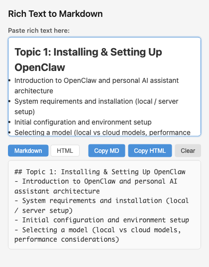

# Rich Text to Markdown Converter

A Chrome extension that converts rich text (HTML) to GitHub Flavored Markdown or clean HTML.



## Features

- **Auto-convert on paste**: Output appears instantly when you paste rich text
- **Markdown & HTML output**: Toggle between GitHub Flavored Markdown and clean HTML
- **GitHub Flavored Markdown**: Supports tables, strikethrough, and task lists
- **HTML conversion**: Headings, lists, inline code, bold, and italic rendered as semantic HTML
- **One-click copy**: Copy the output to clipboard in either format
- **Clean output**: Compact formatting with no extra blank lines

## Installation

### Step 1: Download the Extension

Clone this repository or download as ZIP:

```bash
git clone https://github.com/alfredang/md-converter.git
```

### Step 2: Open Chrome Extensions Page

1. Open Google Chrome
2. Type `chrome://extensions/` in the address bar and press Enter
3. Or click Menu (⋮) → More Tools → Extensions

### Step 3: Enable Developer Mode

Toggle the **"Developer mode"** switch in the top-right corner of the extensions page.

### Step 4: Load the Extension

1. Click the **"Load unpacked"** button
2. Navigate to the `md-converter` folder you downloaded
3. Click **"Select Folder"**

### Step 5: Pin the Extension (Optional)

1. Click the puzzle piece icon (🧩) in the Chrome toolbar
2. Find "Rich Text to Markdown" in the list
3. Click the pin icon to keep it visible in your toolbar

## Usage

1. Copy formatted text from any source (Word, Google Docs, web pages, etc.)
2. Click the extension icon in your Chrome toolbar
3. Paste into the input area (Ctrl/Cmd+V)
4. Output appears automatically (Markdown by default)
5. Switch between **Markdown** and **HTML** tabs to toggle output format
6. Click **"Copy Markdown"** or **"Copy HTML"** to copy the result

## Supported Conversions

| Rich Text | Markdown |
|-----------|----------|
| **Bold** | `**Bold**` |
| *Italic* | `_Italic_` |
| [Links](url) | `[Links](url)` |
| Headings | `# Heading` |
| Bullet lists | `- Item` |
| Numbered lists | `1. Item` |
| Tables | GFM table syntax |
| ~~Strikethrough~~ | `~~Strikethrough~~` |
| Code blocks | Fenced code blocks |

## License

MIT
